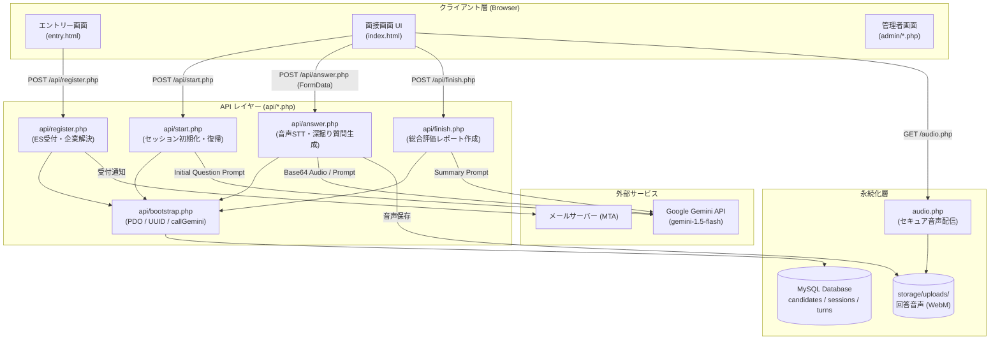
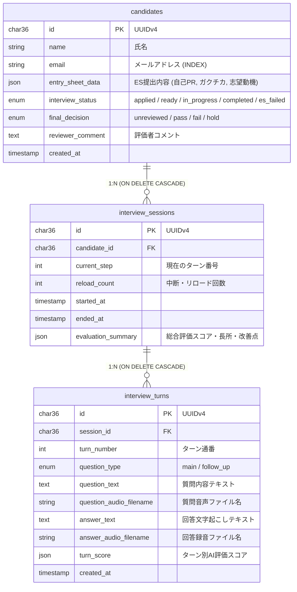

# aimensetu (AI対話型面接システム)

エントリーシート（ES）受付から、Google Gemini API を活用したリアルタイム音声対話型面接、文字起こし、動的深掘り質問生成、自動評価スコアリング、および管理者による選考判定までを一貫して自動化・支援する Web ベースの AI 面接システムです。

---

## 🌟 主な機能

- **マルチテナント対応のエントリー受付 (`entry.html`)**
  - URL クエリパラメータ（`?company=code`）による企業識別
  - 氏名・メールアドレスに加え、自己PR・ガクチカ・志望動機を構造化 JSON で保存
  - 企業別カスタムメールテンプレートによる自動受付確認メール送信 (`mb_send_mail`)
- **ブラウザ完結のリアルタイム AI 音声対話面接 (`index.html`)**
  - 面接前の機器動作確認（マイク・カメラ・スピーカーテスト）および利用規約同意モーダル
  - MediaPipe FaceMesh による視線逸脱・不正監視データの計測
  - ブラウザ音声合成（Web Speech API: SpeechSynthesis）による質問の自動読み上げ
  - MediaRecorder による生音声（WebM 形式）のストリーミング収録 & リアルタイム音声認識フォールバック
- **Gemini 1.5 Flash 連携による対話エンジン (`api/bootstrap.php`, `api/answer.php`)**
  - **マルチモーダル文字起こし (STT)**: 録音音声バイナリ（Base64）を直接 Gemini 1.5 Flash にインライン送信（`temperature: 0.1`）して高精度書き起こし
  - **文脈に応じた動的深掘り質問**: ES 内容と過去ターンの対話履歴をプロンプトへ注入し、具体性に応じて「深掘り（`follow_up`）」か「次テーマ（`next_theme`）」を自律判定
  - **質問タイプ自動判定**: 質問の深さに応じて `type_a` (30秒・要約), `type_b` (60秒・標準), `type_c` (120秒・エピソード) を選定
  - **Structured Outputs (JSON Schema)**: レスポンス形式を厳格に制約し、フォーマット崩れを防止
- **総合評価サマリ自動生成 (`api/finish.php`)**
  - 面接終了時に全ターンの質疑ログを集約し、100点満点スコア、強み・改善点、論理性・具体性の総括、選考推薦コメントを一括算出
- **セキュアな音声配信ゲートウェイ (`audio.php`)**
  - ドキュメントルート外の音声ファイル（`storage/uploads`, `storage/tts`）へのアクセスを制御
  - DB 上のセッション実在確認および `basename()` / `realpath()` によるパストラバーサル防止
- **管理者ポータル & 選考バックオフィス (`admin/`)**
  - セッション認証ガード (`admin/auth.php`)
  - 候補者一覧ダッシュボード (`admin/index.php`)
  - 書類選考（ES 判定）機能 (`admin/screening.php`)
  - 音声再生・ターン別評価確認レポート (`admin/report.php`)
  - 最終合否判定（`pass` / `fail` / `hold`）およびレビューコメント登録 (`admin/judge.php`)
  - 選考結果の CSV エクスポート (`admin/export_csv.php`)

---

## 🛠 技術スタック

| レイヤー | 技術 | 役割・選定理由 |
|---|---|---|
| **バックエンド** | PHP 8.2+ | 厳格な型付け（`declare(strict_types=1);`）と軽量な手続き・関数ベース設計 |
| **データベース** | MySQL 8.0+ / MariaDB 10.5+ | InnoDB エンジン、外部キー制約（`ON DELETE CASCADE`）、JSON 型対応 |
| **AI / LLM** | Google Gemini API (`gemini-1.5-flash`) | 低遅延テキスト生成、マルチモーダル音声文字起こし、構造化 JSON 出力 |
| **フロントエンド** | HTML5, Vanilla JS, CSS3 | 外部フレームワーク非依存。Web Speech API, MediaRecorder, Web Audio API |
| **不正検知** | MediaPipe FaceMesh | ブラウザ上でのリアルタイム視線推定・離脱率ログ記録 |
| **音声補助** | Google Cloud Speech / Text-to-Speech | 音声認識および音声合成クライアント |

---

## 📐 システムアーキテクチャ



---

## 🗄 データベース設計

主要 3 テーブルが UUID v4（`CHAR(36)`）を主キーとして階層的にリレーションを構成しています。



---

## 🚀 デプロイ & セットアップ手順

### 1. 前提要件

* OS: Linux (Ubuntu 22.04 / 24.04 LTS 推奨)
* PHP: 8.2 以上
* 必須拡張: `php-fpm`, `php-mysql`, `php-curl`, `php-mbstring`, `php-json`


* データベース: MySQL 8.0+ または MariaDB 10.5+
* Web サーバー: Nginx 1.20+ または Apache 2.4+
* 有効な Google Gemini API キー（Google AI Studio 等で取得）

### 2. インストール手順

```bash
# 1. リポジトリのクローン
git clone [https://github.com/ipogy/aimensetu.git](https://github.com/ipogy/aimensetu.git)
cd aimensetu

# 2. ストレージディレクトリの作成と権限設定
mkdir -p storage/uploads storage/tts
sudo chown -R www-data:www-data storage/
sudo chmod -R 775 storage/

# 3. 依存ライブラリのインストール (Composer が利用可能な場合)
composer install --no-dev --optimize-autoloader

```

### 3. 環境変数（`.env`）の設定

プロジェクトルート直下に `.env` を作成します。ビルトインの手動パーサーを搭載しているため、Composer パッケージ未導入環境でも動作します。

```env
# データベース接続
DB_HOST=127.0.0.1
DB_PORT=3306
DB_NAME=ss690056_aimensetu
DB_USER=root
DB_PASS=your_db_password

# Google Gemini API
GEMINI_API_KEY=your_gemini_api_key_here
GEMINI_MODEL=gemini-1.5-flash

# 管理者ダッシュボード
ADMIN_USERNAME=admin
ADMIN_PASSWORD_HASH=your_password_hash

# メール配信
MAIL_FROM_ADDRESS=noreply@ai-mensetu.example.com
MAIL_FROM_NAME="AI面接選考事務局"

```

ファイルのパーミッションを保護します：

```bash
chmod 600 .env
sudo chown www-data:www-data .env

```

### 4. データベースの初期化

`schema.sql` を実行してテーブルを作成します。

```bash
mysql -u root -p ss690056_aimensetu < schema.sql

```

### 5. Nginx 設定例

`.env` や `storage/` への直接アクセスを遮断し、大容量音声アップロードと Gemini 通信タイムアウトに対応させます。

```nginx
server {
    listen 80;
    server_name mensetu.example.com;
    return 301 https://$host$request_uri;
}

server {
    listen 443 ssl http2;
    server_name mensetu.example.com;

    root /var/www/aimensetu;
    index index.html index.php;

    ssl_certificate     /etc/letsencrypt/live/[mensetu.example.com/fullchain.pem](https://mensetu.example.com/fullchain.pem);
    ssl_certificate_key /etc/letsencrypt/live/[mensetu.example.com/privkey.pem](https://mensetu.example.com/privkey.pem);

    client_max_body_size 20M;

    # セキュリティ: 設定ファイルとGitのアクセス拒否
    location ~ /\.(env|git) {
        deny all;
        return 404;
    }

    # セキュリティ: storageへの直接アクセスを遮断 (audio.php経由のみ許可)
    location ^~ /storage/ {
        deny all;
        return 403;
    }

    location / {
        try_files $uri $uri/ =404;
    }

    location ~ \.php$ {
        include snippets/fastcgi-php.conf;
        fastcgi_pass unix:/run/php/php8.2-fpm.sock;
        fastcgi_param SCRIPT_FILENAME $realpath_root$fastcgi_script_name;
        include fastcgi_params;

        # Gemini API の通信遅延を考慮したタイムアウト延長
        fastcgi_read_timeout 60s;
        fastcgi_send_timeout 60s;
    }
}

```

---

## 🔒 セキュリティ & 信頼性設計

* **パストラバーサル防御 (`audio.php`)**:
クエリパラメータに対して `basename()` および `realpath()` によるディレクトリ正規化を実施。`storage/uploads` または `storage/tts` 以外のファイル要求は 404 / 403 で遮断します。
* **情報漏洩防止**:
`api/bootstrap.php` の先頭で `ini_set('display_errors', '0');` を指定。本番環境で DB 資格情報やスタックトレースが露出することを防止します。
* **SQL インジェクション対策**:
`PDO::ATTR_EMULATE_PREPARES => false` を強制し、すべてのクエリでネイティブプリペアドステートメントを使用しています。
* **途中離脱・リロード復帰（Resume）制御**:
面接中にブラウザ再読み込みやネットワーク瞬断が発生した場合、進行中セッションを特定して直前の質問から再開。同時に `reload_count` を加算し、不審な再試行を面接官レポートで確認できます。

---

## 📄 ライセンス

本プロジェクトは [MIT License](https://www.google.com/search?q=LICENSE&utm_source=gemini) のもとで公開されています。
